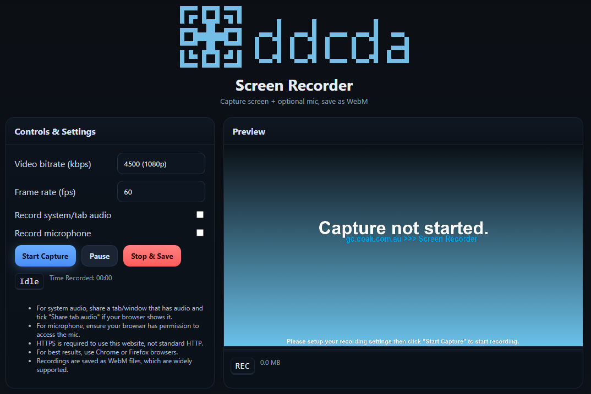

# DDCDA Screen Recorder Online
Website for screen recording with features such as:
- Export to WebM
- Microphone

You can access the website on our [Github Page](https://doakdotcomdotau.github.io/DDCDA-ScreenRecorder/) or [Main Website](https://gc.doak.com.au/screenrecorder).
If you have any issues, please record them on our Issues page on this repository or by sending an email to [this email](mailto:info@gc.doak.com.au).

## Gallery

 

